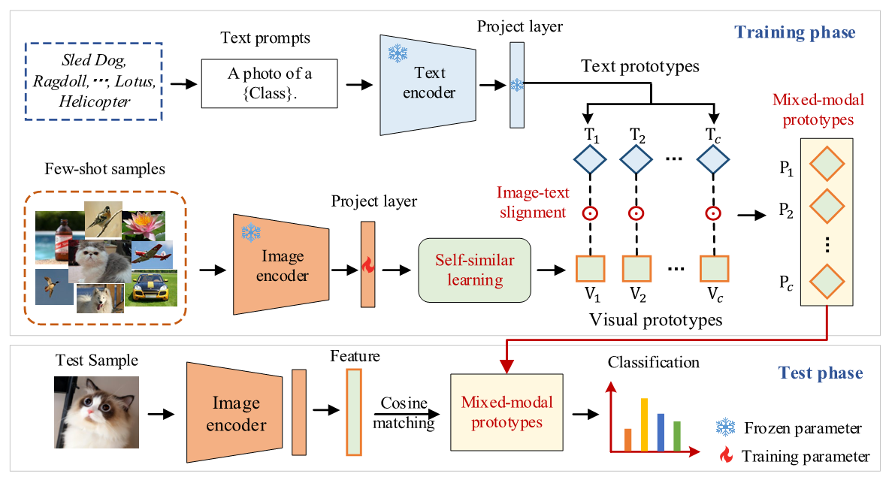

# Partial-tuning Based Mixed-modal Prototypes for Few-shot Classification
This repository contains code for IEEE Transactions on Multimedia 2024 paper [Partial-tuning Based Mixed-modal Prototypes for Few-shot Classification]( ). It contains the code for vision-language adaptation on 11 target image classification datasets and experiments for audiovisual few-shot learning.



# Environment Configuration
We recommend to install the environment through conda and pip. You should make a new environment with python>=3.9, for example:

```
conda create -n cross_modal python=3.9
```

Next, you can download pytorch from official site, for example:

```
conda install pytorch torchvision torchaudio cudatoolkit=11.3 -c pytorch
```

Next, run `pip install -r requirements.txt` in this repo to install a few more packages required by [CLIP](https://github.com/openai/CLIP). 

# Dataset Installation
Follow [DATASETS.md](DATASETS.md) to install the downstream datasets. We use the [CoOp](https://github.com/KaiyangZhou/CoOp) split of data (including the few-shot splits for seed 1-3, except for ImageNet) to ensure a fair comparison.


# Model Training

## Feature Extraction
For all experiments, we pre-extract the features to speed up training time, using [features.py](features.py) to pre-extract image and text features from a frozen CLIP model.

```
python features.py --dataset fgvc_aircraft --train-shot 16 --seed 1 --clip-encoder RN50 --image-layer-idx 0 --text-augmentation hand_crafted --image-augmentation none --image-views 0
```

To reproduce the experiments in main paper (with flipped view and hand-crafted template), you may run the bash script below to extract for all 11 datasets and 3 seeds. (Tip: You can also parallelize the scripts in [features.sh](features.sh) to speed up):

```
bash features.sh
```

## Few-Shot Training
To perform mixed-modal training, please refer to [train.py](train.py). For example, if you want to run mixed-modal adaptation for fgvc_aircraft-16-shot:

```
bash train.sh fgvc_aircraft 0.7 16
```

For all dataset training, you can use

```
bash all_training.sh
```

## Citation
If you use this code in your research, please kindly cite the following papers:

```
@article{su2024partial,
  title={Partial-tuning based mixed-modal prototypes for few-shot classification},
  author={ Su, Yuling and Liu, Xueliang and Zhao, Ye and Hong, Richang and Wang, Meng},
  year={2024},
  journal={IEEE Transactions on Multimedia},s
}
```

## Acknowledgment

This repo benefits from [Tip-Adapter](https://github.com/gaopengcuhk/Tip-Adapter) and [Cross-Modal](https://github.com/linzhiqiu/cross_modal_adaptation). Thanks for their wonderful works.
